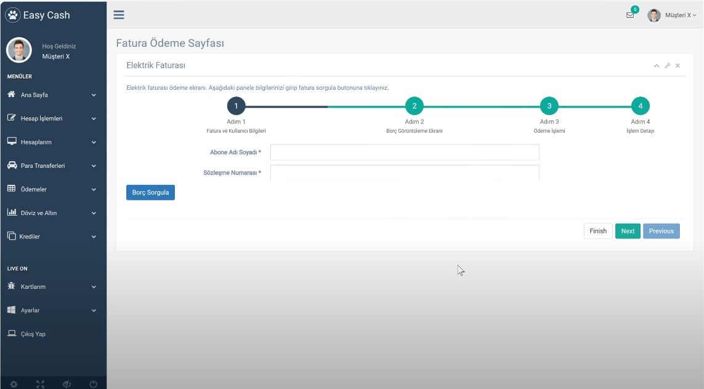

# Easy Cash Asp.Net Core 6.0 Identity Project
  

## Table of Contents

- [Project Overview](#project-overview)
- [Key Features](#key-features)
  - [User Registration and Authentication](#user-registration-and-authentication)
  - [Fund Transfer Operations](#fund-transfer-operations)
  - [Currency Exchange Rate Integration](#currency-exchange-rate-integration)
  - [Invoice Management](#invoice-management)
  - [User Profile and Data Updates](#user-profile-and-data-updates)
  - [Advanced Data Processing and Relationships](#advanced-data-processing-and-relationships)
  - [User Interface and Themes](#user-interface-and-themes)
  - [Error Handling and Confirmation Pages](#error-handling-and-confirmation-pages)
  - [Security Features](#security-features)
- [Project Architecture](#project-architecture)
  - [Backend](#backend)
  - [Frontend](#frontend)
  - [Database](#database)
- [Installation and Setup](#installation-and-setup)
  - [Required Tools and Technologies](#required-tools-and-technologies)
  - [Setup Instructions](#setup-instructions)
- [License](#license)

---

## Project Overview

The **Easy Cash** project is a financial management application that allows users to perform operations such as fund transfers, currency conversions, and invoice management. Built on **ASP.NET Core 6.0** with **ASP.NET Identity**, this application leverages modern web development practices including secure user authentication, encryption, and complex data relationships. The project aims to provide users with a seamless experience for managing their financial operations, with real-time data integration and robust security.

---

## Key Features

### User Registration and Authentication
The system allows users to register and log in securely. During registration, email verification is performed, and passwords are securely hashed using industry-standard techniques. Users can manage their account settings and securely authenticate to access the system.

### Fund Transfer Operations
Users can easily transfer funds between accounts. All transactions are logged for history tracking, and the system provides real-time updates on transaction statuses, ensuring users are informed of successful or failed operations.

### Currency Exchange Rate Integration
Real-time currency exchange rates are integrated into the application. Users can convert their funds between different currencies with up-to-date exchange rate data, providing them with accurate calculations and up-to-date information.

### Invoice Management
The application allows users to create, view, and manage invoices. Invoices can be generated for various financial operations, and the system tracks payment statuses, sending notifications for pending payments. Detailed reports on invoices are available for users and administrators.

### User Profile and Data Updates
Users can view and update their personal information, including contact details, preferences, and passwords. Profile information is securely updated in the database, ensuring data integrity and confidentiality.

### Advanced Data Processing and Relationships
The backend leverages **Entity Framework Core** to manage complex relationships between different data entities such as users, transactions, and invoices. **LINQ** is used to optimize data retrieval and perform efficient queries.

### User Interface and Themes
The frontend uses **Bootstrap** and custom CSS to create a responsive and intuitive user interface. The application adapts to different screen sizes, providing a smooth user experience across devices. The design is modern and user-friendly, featuring dynamic content updates powered by **AJAX** and **jQuery**.

### Error Handling and Confirmation Pages
Robust error handling mechanisms ensure that users are provided with helpful feedback in case of errors. Custom error pages guide users through common mistakes, and confirmation pages ensure that users can review and confirm their actions before finalizing transactions.

### Security Features
The project implements industry-standard security practices such as **JWT Authentication**, password encryption, and **role-based authorization**. The system ensures that each user has access only to the functionalities they are authorized to use, and sensitive data is encrypted both in transit and at rest.

---

## Project Architecture

### Backend
The backend is developed with **ASP.NET Core 6.0**, using **Entity Framework Core** for data persistence. The application follows a **RESTful API** architecture and uses **ASP.NET Identity** for user authentication and management. The application is designed with a modular approach, using various services and repositories to handle business logic.

### Frontend
The frontend is built using **HTML**, **CSS**, **JavaScript**, and **Bootstrap** for a clean and responsive design. The UI is optimized for various screen sizes, ensuring compatibility with desktops, tablets, and mobile devices. Dynamic interactions are powered by **AJAX** and **jQuery**, enhancing the user experience with fast, seamless updates.

### Database
The project uses a relational database (SQL Server or MySQL) to store user data, transaction logs, invoices, and more. **Entity Framework Core** is used for database interactions, enabling seamless migration and updates to the database schema.

---

## Installation and Setup

### Required Tools and Technologies
- **Visual Studio 2022** or **Visual Studio Code** (For ASP.NET Core development)
- **.NET 6 SDK**: [Download .NET 6 SDK](https://dotnet.microsoft.com/download/dotnet)
- **SQL Server or MySQL**: For relational database management.
- **Git**: To clone and manage the repository.

### Setup Instructions

1. Clone the repository:
   ```bash
   git clone https://github.com/username/easy-cash.git
